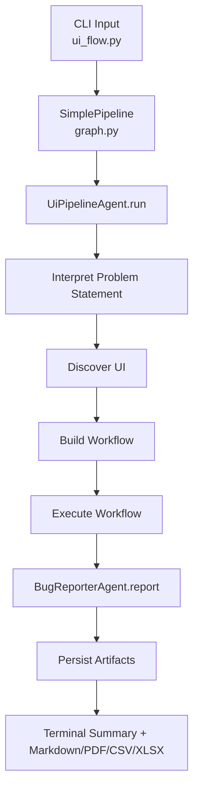

# QUANTUM-QA Architecture

This document describes how the current automation framework discovers UI flows, executes functional and non-functional validations, and produces reports.

## System Overview

At runtime, the framework takes URL + problem statement input and executes a deterministic pipeline:

1. Build run state in `quantum-qa/ui_flow.py`.
2. Invoke graph orchestrator in `quantum-qa/agents/graph.py`.
3. Run UI pipeline in `quantum-qa/agents/ui_pipeline.py`:
   - interpret intent
   - discover elements
   - build workflow actions
   - execute actions in Playwright
   - collect execution metadata
4. Run bug reporter in `quantum-qa/agents/bug_reporter.py`.
5. Persist artifacts and reports under `artifacts/` and `dashboard/data/`.

## High-Level Flow

## Core Components

### 1) Entry Point

File: `quantum-qa/ui_flow.py`

Responsibilities:
- Parse CLI arguments.
- Resolve problem statement text.
- Seed framework state.
- Invoke pipeline and persist outputs.
- Render terminal summary.

Important flags:
- `--ui-url`
- `--ui-problem-statement` or `--ui-problem-statement-file`
- `--ui-mode` (`auto|strict|explore`)
- `--run-profile` (`demo|balanced|thorough`)
- `--nfr-only`
- `--headed`
- `--clean-run-data`

### 2) Pipeline Orchestrator

File: `quantum-qa/agents/graph.py`

Responsibilities:
- Compose agents in order.
- Pass state from UI pipeline to bug reporter.
- Append audit trail entries.

### 3) UI Pipeline

File: `quantum-qa/agents/ui_pipeline.py`

Responsibilities:
- Intent interpretation from natural language.
- Browser discovery of interactive elements.
- Workflow generation from parsed steps.
- Functional action execution.
- NFR execution and category summaries.
- Screenshot and execution evidence capture.

Action types supported:
- Functional: `goto`, `click`, `fill`, `select`, `check`, `wait`, `refresh`, `assert_visible`, `assert_url_contains`
- NFR: `accessibility_scan`, `performance_budget`, `security_smoke`, `visual_compare`

NFR profile policy:
- Implemented through `_nfr_policy()` with thresholds for `demo`, `balanced`, `thorough`.
- Controls tolerance for accessibility, performance, and visual comparison behavior.

NFR-only behavior:
- `--nfr-only` prepends bootstrap functional steps via `_nfr_setup_actions()` so checks run on a stable, realistic page state.

### 4) Bug Reporter

File: `quantum-qa/agents/bug_reporter.py`

Responsibilities:
- Convert failed workflow steps into structured bug entries.
- Provide severity/classification metadata used in reports.

## Data Model (State)

Primary state keys flowing through the pipeline:
- `ui_input`
- `llm_interpretation`
- `ui_discovery`
- `ui_workflow`
- `ui_execution`
- `inspection_report`
- `bug_report`
- `audit_trail`

`ui_execution` generally contains:
- `steps` (per-step status/details)
- `workflow_summary` (planned/executed/passed/failed/skipped)
- `check_summary` (NFR totals and per-category counts)
- `locator_summary`
- artifact paths (execution JSON and screenshots)

## Artifact and Reporting Paths

Generated outputs:
- `artifacts/ui_generated/<host>/<scenario>/ui_discovery.json`
- `artifacts/ui_generated/<host>/<scenario>/workflow_plan.json`
- `artifacts/ui_generated/<host>/<scenario>/ui_execution.json`
- `artifacts/ui_generated/<host>/<scenario>/step_screenshots/*`
- `artifacts/execution/core_action_plan.json`
- `artifacts/execution/execution_result.json`
- `artifacts/reports/test_summary.md`
- `artifacts/reports/business_impact_analysis.md`
- `artifacts/bugs/bug_report.json|csv|xlsx|pdf`

Dashboard data:
- `dashboard/data/latest_run.json`
- `dashboard/data/audit_trail.json`

## Negative Test Strategy in This Repo

Current negative tests are expressed as plain-English scenario files under:
- `quantum-qa/Problemstatement/`

Example pack:
- `workflow_gajab_negative_business.txt`

Execution model:
- Negative behavior is validated via assertions that expected errors/messages remain visible and progression is blocked.

## NFR Reporting Behavior

- NFR summary appears only when NFR checks are executed.
- Categories are dynamic and include only checks seen in run steps.
- Category buckets: accessibility, performance, security, visual.

## Extension Points

1. Stronger assertions:
- Add domain-specific assertion handlers in `ui_pipeline.py` for standardized error-message matching.

2. Separate scenario suites:
- Maintain one problem statement file per scenario for cleaner pass/fail attribution.

3. Deep NFR integrations:
- Integrate external tools (axe, Lighthouse, ZAP) while retaining current lightweight checks.

4. Parser hardening:
- Skip metadata lines (for example, informational headers) to prevent accidental action generation.

## Operational Notes

- Generated `artifacts/` content is gitignored.
- If artifacts were already tracked historically, run:
  - `git rm -r --cached artifacts`

- For unstable environments:
  - prefer `--run-profile demo` for NFR.
  - increase `--step-pause-ms` for UI synchronization.
