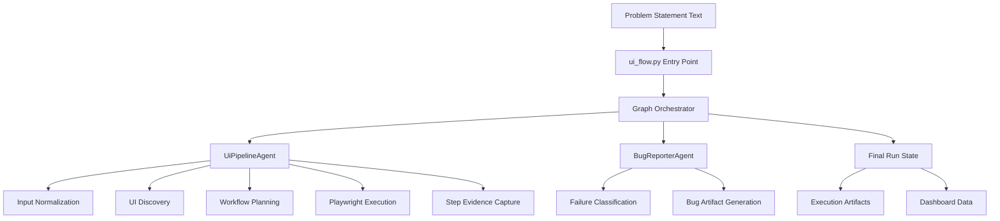

# QUANTUM-QA Framework Demo Guide

Autonomous UI testing framework for live website workflows with evidence-first reporting.

This repository is prepared as a demonstration project for Gajab end-to-end automation.

## 1. What This Framework Does

QUANTUM-QA converts a natural-language problem statement into a runnable browser workflow.

- Discovers actionable UI elements from the live page.
- Interprets test intent from plain text steps.
- Executes step-by-step browser actions with Playwright.
- Captures screenshots and execution traces for every stage.
- Produces structured outputs for execution, bugs, and business impact.

## 2. Demo Objective

The showcase flow covers a realistic customer journey:

- login and profile completion
- location selection
- deal and trending discovery
- product filtering and bargain flow
- checkout handoff and payment provider interaction

The demo workflow is tuned for live stability and presentation value.

## 3. High-Level Architecture



## 4. Execution Flow

1. Read problem statement from file or inline text.
2. Parse business steps into automation actions.
3. Discover current-page locators and fallback candidates.
4. Execute actions in strict stage order.
5. Record pass, fail, skip status with screenshots.
6. Build summary reports and bug artifacts.

## 5. Core Components

- quantum-qa/ui_flow.py
  - CLI entrypoint and run orchestration
  - report and artifact persistence

- quantum-qa/agents/graph.py
  - state graph wiring between agents

- quantum-qa/agents/ui_pipeline.py
  - step interpretation and action planning
  - locator healing and fallback strategy
  - Playwright runtime execution engine

- quantum-qa/agents/bug_reporter.py
  - defect extraction and report generation

- quantum-qa/Problemstatement/workflow_gajab_demo.txt
  - stable showcase workflow for demonstration

## 6. Run Modes and Inputs

Main CLI options:

- --ui-url
- --ui-problem-statement-file
- --ui-mode (auto, strict, explore)
- --run-profile (demo, balanced, thorough)
- --headed
- --clean-run-data
- --step-pause-ms

Recommended demo mode:

- ui-mode: strict
- run-profile: demo
- headed: enabled
- clean-run-data: enabled

## 7. Quick Start

Install requirements:

```bash
pip install -r quantum-qa/requirements.txt
playwright install chromium
```

Run the showcase script:

```powershell
powershell -ExecutionPolicy Bypass -File quantum-qa/run_demo.ps1
```

Run directly with CLI:

```bash
python quantum-qa/ui_flow.py \
  --ui-url "https://stg.gajab.com/" \
  --ui-problem-statement-file "quantum-qa/Problemstatement/workflow_gajab_demo.txt" \
  --ui-mode strict \
  --run-profile demo \
  --step-pause-ms 900 \
  --clean-run-data \
  --headed
```

## 8. Output Artifacts

Generated per run:

- artifacts/execution/core_action_plan.json
- artifacts/execution/execution_result.json
- artifacts/reports/test_summary.md
- artifacts/reports/business_impact_analysis.md
- artifacts/bugs/bug_report.json
- artifacts/bugs/bug_report.csv
- artifacts/bugs/bug_report.xlsx
- artifacts/bugs/bug_report.pdf
- artifacts/ui_generated/.../step_screenshots/

Dashboard updates:

- dashboard/data/latest_run.json
- dashboard/data/audit_trail.json

## 9. Demo-Friendly Notes

- Start from a logged-out browser state.
- Keep one active browser session during narration.
- Use step pause to make transitions visible to audience.
- Payment provider behavior may vary by sandbox state; the framework captures the exact observed outcome.

## 10. Troubleshooting Tips

- If a selector fails, rerun once with clean-run-data.
- If site state changed, begin from logged-out home.
- If checkout behavior changes, review execution_result.json for the exact failing stage.
- Use workflow_gajab_demo.txt as the single showcase scenario.

## 11. Repository Layout

```text
.
|-- quantum-qa/
|   |-- ui_flow.py
|   |-- run_demo.ps1
|   |-- agents/
|   |   |-- graph.py
|   |   |-- ui_pipeline.py
|   |   `-- bug_reporter.py
|   |-- Problemstatement/
|   |   `-- workflow_gajab_demo.txt
|   `-- requirements.txt
`-- README.md
```
